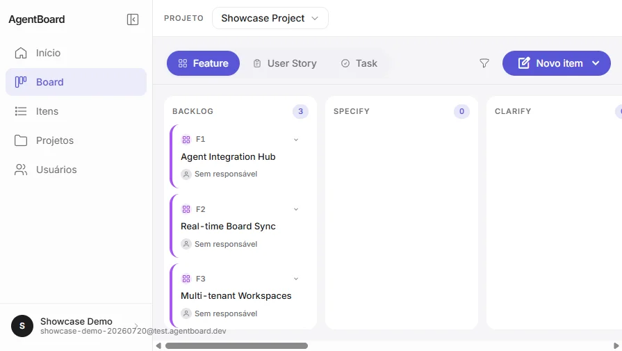
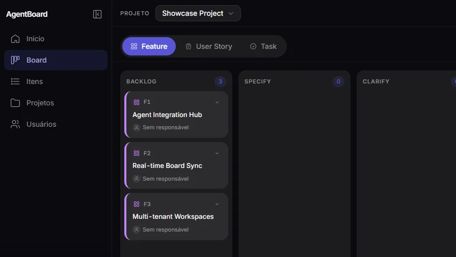
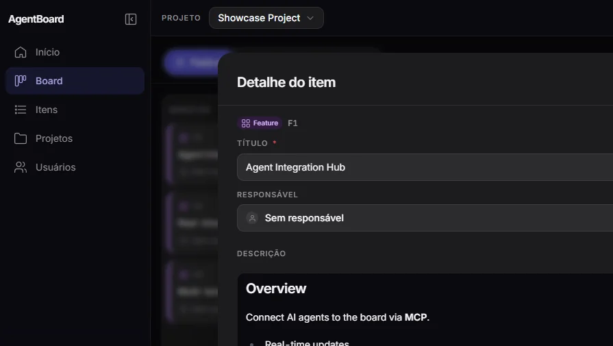

# agentboard-web

React 18 + Vite 5 + Tailwind CSS 3 frontend for AgentBoard.


**Demo:** https://agentboard.matheusmafioletti.com  
**Stack:** React 18 · Vite 5 · Tailwind CSS 3 · SWR · @dnd-kit

## Screenshots

| Light mode | Dark mode |
|---|---|
|  |  |

| Sidebar navigation | Work item detail |
|---|---|
|  |  |

## Prerequisites

| Tool | Version |
|------|---------|
| Node.js | 20 LTS |
| npm | 10+ |

## Setup

```bash
npm install
```

## Development

```bash
# Start dev server at http://localhost:3010
npm run dev

# Run tests
npm test

# Run tests with coverage gate
npm run test:coverage

# Typecheck (tsc --noEmit)
npm run typecheck

# Lint
npm run lint

# Production build
npm run build
```

## Environment variables

| Variable | Default | Description |
|----------|---------|-------------|
| `VITE_AUTH_SERVICE_URL` | `http://localhost:8080` | Auth API base URL |
| `VITE_BOARD_SERVICE_URL` | `http://localhost:8081` | Board API + WebSocket base URL |

In the demo environment both point to the same public origin (nginx routes `/auth` and `/api/v1`).

## Docker

```bash
docker build \
  --build-arg VITE_AUTH_SERVICE_URL=https://agentboard.matheusmafioletti.com \
  --build-arg VITE_BOARD_SERVICE_URL=https://agentboard.matheusmafioletti.com \
  -t agentboard-web:local .
```

Images published to GHCR: `ghcr.io/<owner>/agentboard-web` (`latest`, `e2e-latest`, `<sha>`, `e2e-<sha>`).

## Deploy (demo VPS)

On push to `develop`, the **CD** workflow builds, pushes images to GHCR, and dispatches `deploy-web` to [agentboard-infra](https://github.com/matheusmafioletti/agentboard-infra). After a successful deploy, infra dispatches `post-deploy-verify` to run staging smoke tests.

Push to `main` runs a production simulation only (no deploy).

Requires GitHub Secret `INFRA_DEPLOY_PAT` and variable `DEMO_PUBLIC_URL` (`https://agentboard.matheusmafioletti.com`).

## CI/CD pipeline

Four workflows run on pull requests, pushes, and after deploy:

| Workflow | Trigger | Purpose |
|---|---|---|
| **CI** | `pull_request` → `develop`/`main` | Lint, typecheck, test+coverage, build, publish preview images, E2E suite |
| **CD** | `push` → `develop`/`main` | Build, publish GHCR images (`develop`), deploy (`develop`), production simulation (`main`) |
| **Post-deploy** | `repository_dispatch` `post-deploy-verify` or manual | Staging smoke across all E2E frameworks |

### Branch protection — required checks

Configure these status checks on `develop` (and `main` if applicable):

**`develop` (integration branch — same as backend):**

- `build`
- `e2e-playwright`
- `e2e-cypress`
- `e2e-selenium`

**`main` (production branch):**

- `build`

E2E jobs run inside the CI workflow only after `build` and `publish-preview` succeed (`needs` chain).

### GitHub Secrets

| Secret | Description |
|--------|-------------|
| `INFRA_DEPLOY_PAT` | PAT with `repo` scope — dispatches deploy/rollback to `agentboard-infra` |
| `QA_REPORTS_PAT` | PAT with `contents: write` on `agentboard-qa-reports` — publishes test reports to GitHub Pages |
| `E2E_STAGING_USER_EMAIL` | Staging smoke user email (post-deploy workflow) |
| `E2E_STAGING_USER_PASSWORD` | Staging smoke user password (post-deploy workflow) |

### GitHub Variables

| Variable | Description |
|----------|-------------|
| `DEMO_PUBLIC_URL` | Public demo URL baked into production Docker images |
| `BASE_URL` | Staging base URL for post-deploy E2E (`https://agentboard.matheusmafioletti.com`) |

### QA reports portal

Test reports are published to [agentboard-qa-reports](https://github.com/matheusmafioletti/agentboard-qa-reports) GitHub Pages (`publish-reports-pr` / `publish-reports-staging`). Requires `QA_REPORTS_PAT` secret.

### E2E stack composite action

`.github/actions/e2e-stack` checks out `agentboard-infra`, logs into GHCR, and runs `e2e-up.sh` / `seed-e2e-data.sh` or `e2e-down.sh`. Pre-merge uses `web_tag=e2e-<pr-sha>` with stable backend `latest` images.

## Architecture

```
src/
├── services/
│   ├── boardApi.ts   ← board/project/work-item HTTP + domain types
│   └── authApi.ts    ← auth HTTP (login, register, invites)
├── hooks/            ← useBoardWebSocket, useAuth, useDarkMode, ...
├── components/
│   ├── board/        ← WorkItemBoard, WorkItemCard, WorkItemColumn, CreateWorkItemModal
│   ├── items/        ← ItemsListView
│   ├── card-modal/   ← CardModal (work item detail + Markdown)
│   └── layout/       ← AppShell, AppSidebar, ProjectSelector
├── pages/            ← one file per route
└── router/           ← AppRouter.tsx
```

### HTTP and real-time layers

| Module | Role |
|--------|------|
| `src/services/boardApi.ts` | All board/project/work-item API calls and domain types (`WorkItem`, `Project`, `CreateWorkItemPayload`, …) |
| `src/services/authApi.ts` | Auth API calls (login, register, change password, invites) |
| `src/hooks/useBoardWebSocket.ts` | STOMP over SockJS — project-scoped board updates |

### Kanban components

The unified board lives under `src/components/board/`:

- `WorkItemBoard` — FEATURE / USER_STORY / TASK kanban with drag-and-drop
- `WorkItemCard` / `WorkItemColumn` — draggable cards and drop zones
- `CreateWorkItemModal` / `ParentFilterSelector` — creation and parent filtering
- `CardModal` (`src/components/card-modal/`) — work item detail with sanitized Markdown

### Routes

| Path | Page | Notes |
|------|------|-------|
| `/inicio` | `InicioPage` | Dashboard summary |
| `/board` | `BoardPage` | Unified kanban; reads `?type=` and `?parentId=` |
| `/itens` | `ItemsPage` | Flat table of all work items with filters |
| `/projetos` | `ProjetosPage` | Project list |
| `/projetos/:id` | `ProjectDetailPage` | Project detail |
| `/usuarios` | `UsuariosPage` | Tenant user management (admin only) |
| `/features` | redirect → `/board` | Legacy |
| `/user-stories` | redirect → `/board?type=USER_STORY` | Legacy |

### UI stack

- **React Router v6** for client-side routing
- **SWR** for data fetching (polling ≤ 3s)
- **@dnd-kit** for drag-and-drop Kanban board
- **Tailwind CSS** for styling (class-based dark mode)

### Test coverage gate

Vitest coverage thresholds are enforced in `vite.config.ts`:

| Metric | Minimum |
|--------|---------|
| Lines | 70% |
| Statements | 70% |
| Functions | 50% |
| Branches | 64% |

Run locally: `npm run test:coverage`
